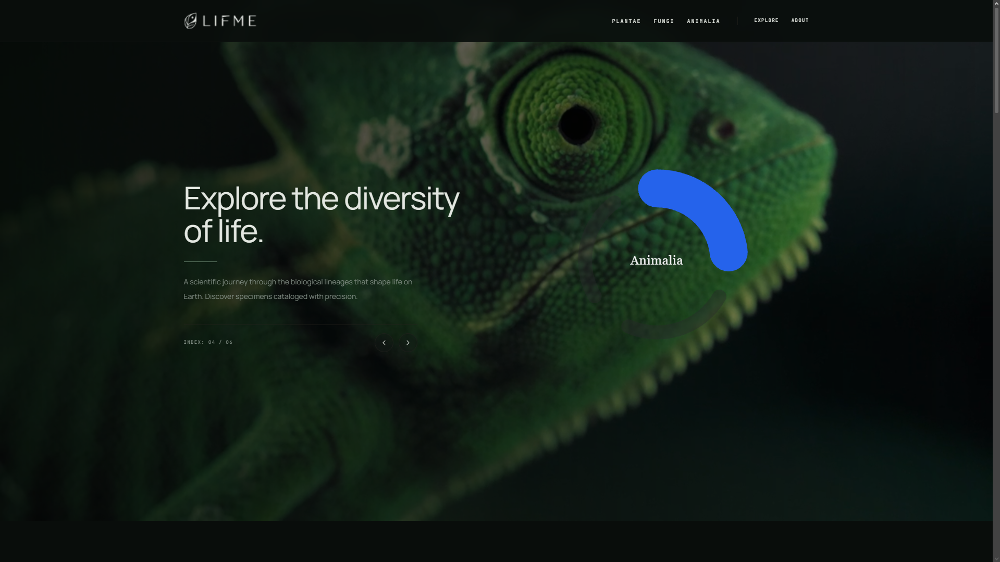
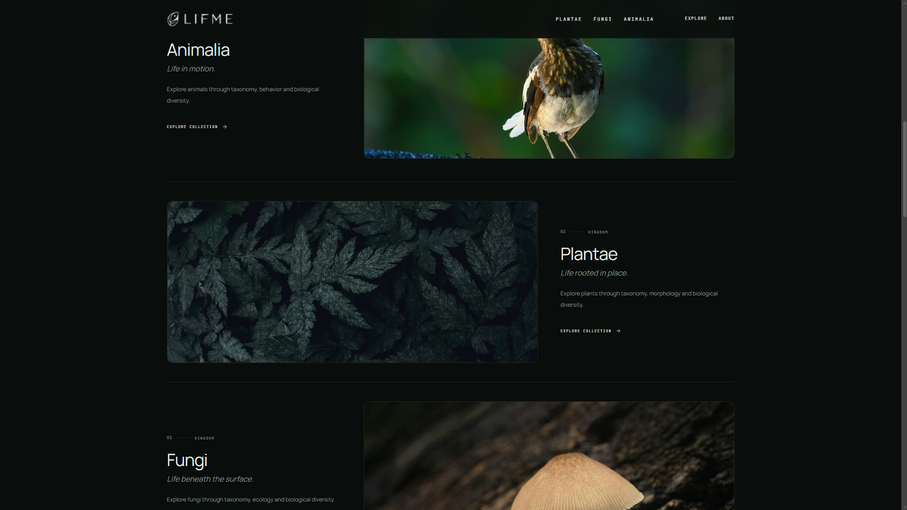
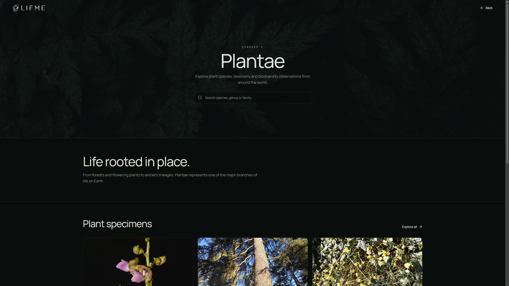
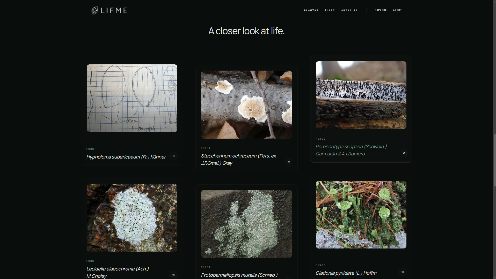

# Lifme 🌿

> Explore the diversity of life through science, taxonomy and biodiversity.

Lifme is a scientific web project focused on exploring the diversity of life through biological classification, species and natural ecosystems.

The project is being developed with a clean, editorial and scientific approach, combining visual exploration with structured biological information.

---

## 📸 Preview da Interface

|             Visão Geral (Hero)              |            Reinos Biológicos             |
| :-----------------------------------------: | :--------------------------------------: |
|  |  |

|               Reino Plantae               |              Reino Fungi              |
| :---------------------------------------: | :-----------------------------------: |
|  |  |

---

## About

Lifme aims to create a digital space where users can explore different forms of life, including:

- Plants
- Animals
- Fungi
- Species
- Biological kingdoms
- Taxonomy
- Biodiversity

The project is currently under development.

## Tech Stack

- Next.js
- React
- TypeScript
- Tailwind CSS
- Lucide React

## Design

The visual identity of Lifme is inspired by scientific archives, botanical collections and natural history.

The interface focuses on:

- Minimalism
- Scientific typography
- Dark natural tones
- Editorial layouts
- Botanical and biological imagery
- Clear information hierarchy
